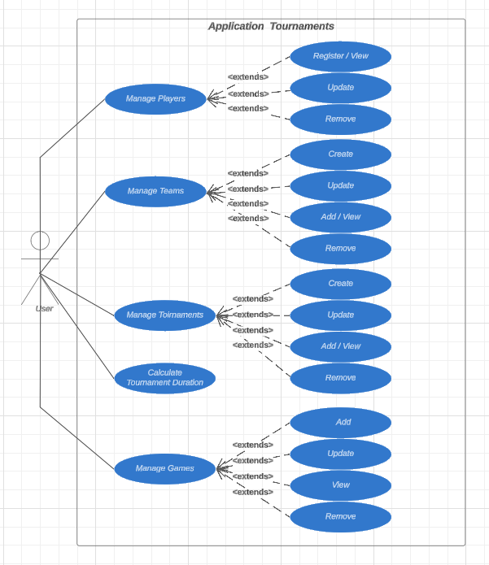

# Krosmoz Clash

## Contexte du projet

Une organisation d'e-sport souhaite développer une application de gestion pour organiser et suivre des tournois de jeux vidéo. Cette application servira à gérer les joueurs, les équipes et les tournois.

## Fonctionnalités principales

- **Gestion des joueurs**:
  - Inscription
  - Modification
  - Suppression
  - Affichage d'un ou plusieurs joueurs

- **Gestion des équipes**:
  - Création
  - Modification
  - Ajout/retrait de joueurs
  - Affichage d'une ou plusieurs équipes

- **Gestion des tournois**:
  - Création
  - Modification
  - Ajout/retrait d'équipes
  - Affichage d'un ou plusieurs tournois

## Structure des classes principales

- **Joueur**:
  - pseudo
  - âge
  - équipe

- **Equipe**:
  - nom
  - joueurs
  - tournois
  - classement

- **Tournoi**:
  - titre
  - jeu
  - date de début
  - date de fin
  - nombre de spectateurs
  - équipes
  - durée estimée
  - temps de pause entre les matchs
  - temps de cérémonie
  - statut (PLANIFIE, EN_COURS, TERMINE, ANNULE)

- **Jeu**:
  - nom
  - difficulté
  - durée moyenne d'un match

## Interfaces

### TournoiDao

- **Méthode**: `calculerdureeEstimeeTournoi(Long tournoiId)`

### TournoiMetier

- **Méthode**: `obtenirdureeEstimeeTournoi(Long tournoiId)`

## Classes d'implémentation

- **TournoiDaoImpl**: implémente `TournoiDao`
- **TournoiDaoExtension**: implémente `TournoiDao`
- **TournoiMetierImpl**: implémente `TournoiMetier`

## Règles de calcul de la durée totale estimée du tournoi

- **Calcul de base** (`TournoiDaoImpl`):
  - Durée estimée = (Nombre d'équipes × Durée moyenne d'un match) + (Temps de pause entre les matchs)

- **Calcul avancé** (`TournoiDaoExtension`):
  - Durée estimée = (Nombre d'équipes × Durée moyenne d'un match × difficulté du jeu) + (Temps de pause entre les matchs) + (Temps pour les cérémonies d'ouverture et de clôture)

## Structure du projet

- **Fichiers de configuration**:
  - `applicationContext.xml` (configuration Spring)
  - `pom.xml` (configuration Maven)
  - `persistence.xml` (configuration JPA et H2)
  - Autres fichiers de configuration si nécessaire

- **Couche de modèle** (entités JPA)
- **Couche de repository** (utilisant JPA/Hibernate)
- **Couche de service** (logique métier)
- **Couche utilitaire**
- **Classe présentation** avec menu console (Méthode `main()` pour démarrer l'application + Utilisation de `ApplicationContext` pour charger la configuration Spring sans annotations)
- **Tests unitaires**

## Exigences techniques

### Nouvelles exigences

- Utiliser H2 comme SGBD
- Utiliser Spring Core pour l'Inversion of Control (IoC) et la Dependency Injection (DI) via configuration XML (`applicationContext.xml`)
- Créer une extension (`TournoiDaoExtension`) pour démontrer le principe Open/Closed
- Implémenter des tests unitaires et au moins un test d'intégration
- Utiliser JaCoCo pour mesurer la couverture de code

### Anciennes exigences

- Développer avec Java 8
- Utiliser Maven pour la gestion des dépendances
- Créer des tests unitaires avec JUnit et Mockito
- Implémenter les design patterns Repository et Singleton
- Ajouter un système de logging (LOGGER)
- Utiliser JPA et Hibernate pour l'accès aux données
- Mettre en place les validations nécessaires de Hibernate avec des annotations Validator
- Développer la classe principale avec un menu console pour interagir avec l'application
- Générer le fichier JAR

## Outils de travail

- Gérer le projet avec Git en utilisant des branches
- Utiliser un IDE de votre choix
- Utiliser JIRA pour la gestion du projet en méthode Scrum

## Screenshots JIRA

Voici quelques captures d'écran de notre tableau JIRA pour la gestion des tâches du projet :


## UML Diagrams

Les diagrammes UML pour le projet sont présentés ci-dessous :




## Restrictions

- Ne pas utiliser `System.out.println()` pour l'affichage
- Ne pas utiliser Log4j; utiliser le système de logging LOGGER avec SL4J ou logging natif
- Créer un simple projet Java, PAS un projet Spring Boot
- Il est interdit d'utiliser les annotations Spring suivantes:
  - `@Service`
  - `@Repository`
  - `@Component`
  - `@SpringBootApplication`
  - `@Autowired`
  - `@ComponentScan`

## Installation du projet

Pour installer et exécuter le projet **Krosmoz Clash**, veuillez suivre les étapes ci-dessous :

1. **Cloner le dépôt**:
   ```bash
   git clone https://github.com/HAFSA159/Krosmoz_Clash
   cd krosmozclash